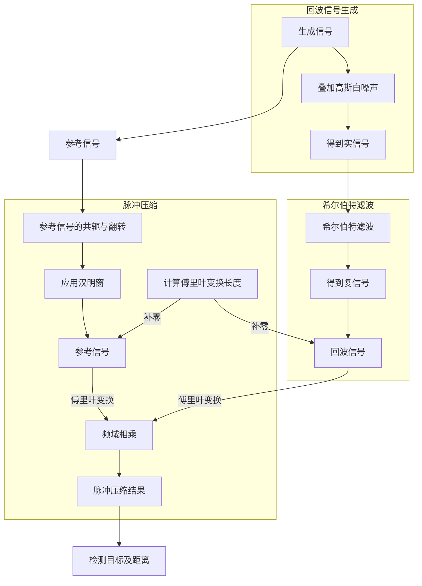

# 基于飞腾平台的远距离探测系统

## 项目内容

项目基于 VISPL 函数库实现以下内容

### 封装汉明窗（Hamming Window）

$$
w(n)=a_0-(1-a_0)\cos\left(\frac{2\pi n}{N-1}\right), \quad 0\leq n\leq N-1
$$

### 利用余弦函数构造一个雷达回波脉冲（实信号）

线性调频信号的相位可以表示为：

$$
\varphi(t)=2\pi f_{\text{low}}t+\frac{\pi\text{BW}}{\tau}t^2
$$

线性调频的复信号则可以用欧拉公式表示为：

$$
s(t) = e^{i\varphi(t)}
$$

由于雷达回波得到的是实信号，所以我们只需要取复信号的实部即可，即应用余弦函数

$$
s_{\text{real}}(t) = \cos\left(2\pi f_{\text{low}}t+\frac{\pi\text{BW}}{\tau}t^2\right)
$$

设两个物体相聚为 $d$，则两个物体的回波相差的时间为

$$
\Delta t = \frac{2d}{c}
$$

其中 $c$ 为光速， $d$ 为两个物体的距离。假设接收到第一个物体反射信号的时间为 $t_0$，则雷达接收到的两个物体的信号分别为

$$
\begin{aligned}
s_1(t) &= \cos\left(2\pi f_{\text{low}}(t-t_0)+\frac{\pi\text{BW}}{\tau}(t-t_0)^2\right)\\
s_2(t) &= \cos\left(2\pi f_{\text{low}}(t-t_0-\Delta t)+\frac{\pi\text{BW}}{\tau}(t-t_0-\Delta t)^2\right)
\end{aligned}
$$

叠加的信号为

$$
s(t) = s_1(t)+s_2(t)
$$

### 在回波上叠加使其信噪比为 0dB 的高斯白噪声

信噪比的定义如下（单位为分贝）：

$$
\text{SNR} = 10\log_{10}\frac{P_{\text{signal}}}{P_{\text{noise}}}
$$

对于离散的采样，信噪比可以表示为：

$$
\text{SNR} = 10\log_{10}\frac{\sum_{i=0}^{N-1}x_i^2}{\sum_{i=0}^{N-1}n_i^2}
$$

其中 $x_i$ 为信号，$n_i$ 为噪声，且振幅满足分布：

$$
n \sim \mathcal{N}\left(0, \frac{\sum x_i^2}{10^{\left(\frac{\text{SNR}}{10}\right)}N} \right)
$$

### 设计希尔伯特滤波器

定义符号函数：

$$
\text{sgn}(x)=\begin{cases}
1, & x>0\\
0, & x=0\\
-1, & x<0
\end{cases}
$$

对于时域信号 $x(t)$，设其频域表示为 $X(\Omega)$，则在频域下的希尔伯特变换可以表示为：

$$
\widehat{X}(\Omega) = [-j\text{sgn}(\Omega)]X(\Omega) 
$$

假设希尔伯特变换之后信号的时域表示为 $\widehat{x}(t)$，则希尔伯特滤波结果的时域表示为：

$$
s(t) = x(t)+j\widehat{x}(t)
$$

其频域表示为：

$$
\begin{aligned}
S(\Omega) &= X(\Omega)+j\widehat{X}(\Omega)\\
            &= X(\Omega)+j[-j\text{sgn}(\Omega)]X(\Omega)\\
            &= [1+\text{sgn}(\Omega)]X(\Omega)
\end{aligned}
$$

则希尔伯特滤波器的频域表示为：

$$
H(\Omega) = 1+\text{sgn}(\Omega)
$$

表示为时域下的卷积运算：

$$
s(t) = h(t) * x(t)
$$

其中 $h(t)$ 为希尔伯特滤波器 $H(\Omega)$ 的时域表示，通过逆傅里叶变换可以得到：

$$
\begin{aligned}
h(t) &= \mathcal{F}^{-1}\{H(\Omega)\}\\
        &= \mathcal{F}^{-1}\{1+\text{sgn}(\Omega)\}\\
        &= \delta(t)+\frac{1}{\pi t}
\end{aligned}
$$

但是由于所采用的是离散时间，所以需要对 $H(\Omega)$ 做离散时间傅里叶逆变换，得到 $h(t)$ 的离散表示：

$$
\begin{aligned}
h(n) &= \frac{1}{2\pi}\int_{-\pi}^{\pi}[1+\text{sgn}(\omega)]e^{j\omega n}\mathrm{d}\omega \\
& = \frac{1}{2\pi}\int_{0}^{\pi}2e^{j\omega n}\mathrm{d}\omega 
= \frac{1}{\pi}\int_{0}^{\pi}e^{j\omega n}\mathrm{d}\omega \\
& = \frac{1}{\pi}\frac{e^{j\pi n} - 1}{jn} = \frac{\cos\pi n - 1}{j\pi n} = \frac{j(1-\cos\pi n)}{\pi n}\\
& = \begin{cases}
1, & n=0\\
\frac{2j}{\pi n}, & n \text{ 为奇数} \\
0, & n \text{ 为偶数}
\end{cases}
\end{aligned}
$$

### 应用脉冲压缩

### 检测目标数量和间距


## 流程图与关键接口

### 流程图



### 关键接口

生成线性调频信号：

```c
void generate_lfm_signal(vsip_scalar_f f_tau, vsip_scalar_f f_freq_sampling,
                         vsip_scalar_f f_freq_low, vsip_scalar_f f_band_width,
                         vsip_cvview_f *p_vector_dst);

void generate_lfm_signal_real(vsip_scalar_f f_tau, vsip_scalar_f f_freq_sampling,
                              vsip_scalar_f f_freq_low, vsip_scalar_f f_band_width,
                              vsip_vview_f *p_vector_dst);
```

生成高斯白噪声：

```c

void generate_wgn_signal(vsip_vview_f *p_vector_signal, vsip_scalar_f f_snr,
                         vsip_vview_f *p_vector_dst);
```

合成雷达信号:

```c
void generate_radar_signal(vsip_scalar_f f_tau, vsip_scalar_f f_freq_sampling,
                           vsip_scalar_f f_freq_low, vsip_scalar_f f_band_width,
                           vsip_scalar_f f_distance, vsip_vview_f *p_vector_dst);
```

脉冲压缩：

```c
void pulse_compress(vsip_cvview_f *p_vector_signal_src, vsip_cvview_f *p_vector_signal_ref,
                    vsip_cvview_f *p_vector_dst);
```

## 关于本项目

本项目为 NKU 2023 暑期实习实训飞腾课程大作业。
